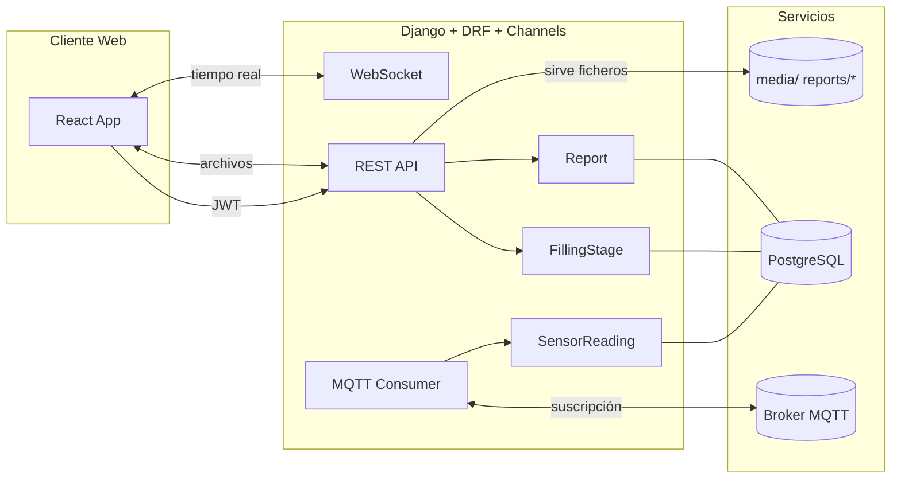
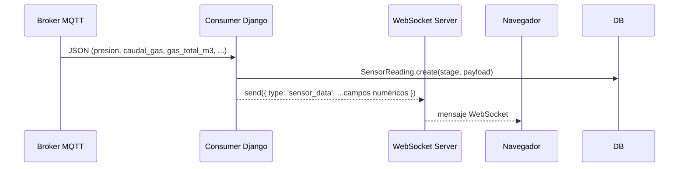

# Backend del Sistema Biogestor

Guía completa para instalar, operar y extender el backend (Django + DRF + Channels) del Biogestor. Cubre arquitectura, flujos, modelos de datos, APIs con ejemplos, WebSockets/MQTT, reportes, seguridad, despliegue, observabilidad y runbooks operativos.

Tabla de contenidos
- Visión general y arquitectura
- Estructura del proyecto y convenciones
- Requisitos, instalación y ejecución (dev/prod)
- Variables de entorno y configuración
- Modelo de datos (ERD, campos, índices)
- APIs REST (autenticación y dashboard) con ejemplos cURL
- WebSockets y MQTT (formatos, flujo, persistencia)
- Reportes (cálculo, archivos, descarga)
- Seguridad y control de acceso
- Observabilidad (logs, métricas, salud)
- Testing (unitario/integración) y datos de ejemplo
- Rendimiento y escalabilidad
- Despliegue (ASGI, Nginx, almacenamiento)
- Runbooks (operación y recuperación)
- Solución de problemas

## 1) Visión general y arquitectura

El backend expone APIs REST para gestionar usuarios, etapas de llenado y reportes; procesa datos de sensores recibidos por MQTT, los retransmite vía WebSocket y los persiste para cálculos de producción (esperada vs real).



## 2) Estructura del proyecto y convenciones

- `backend/BGProject/`: configuración central, `asgi.py` y `urls.py`.
- `backend/dashboard/`: modelos `FillingStage`, `SensorReading`, `Report`; views REST; consumers WebSocket/MQTT.
- `backend/usuarios/`: registro/login JWT, perfiles (aprobación) y permisos.
- `media/`: destino de ficheros generados (PDF, Excel, CSV).

Nombres y convenciones:
- Endpoints se agrupan bajo `/api/dashboard/` y `/api/*` (usuarios).
- Archivos de reportes en subcarpetas `reports/pdf|excel|csv/`.
- Orden natural descendente por fecha en modelos con `created_at`.

## 3) Requisitos, instalación y ejecución

Requisitos:
- Python 3.12+
- PostgreSQL 15+
- Broker MQTT (Mosquitto en `localhost:1883`)

Instalación rápida:
```bash
python3 -m venv .venv
source .venv/bin/activate
pip install -r requirements.txt  # ejecutar desde raíz del repo
cd backend
python manage.py migrate
python manage.py runserver 0.0.0.0:8000
```

Base de datos con Docker:
```bash
docker compose up -d  # levanta PostgreSQL con credenciales por defecto
```

## 4) Variables de entorno y configuración

Crea `backend/BGProject/.env`:
```env
DJANGO_SECRET_KEY=changeme
DEBUG=True
```

Configuraciones destacadas (`BGProject/settings.py`):
- Autenticación: `REST_FRAMEWORK.DEFAULT_AUTHENTICATION_CLASSES = JWTAuthentication`.
- CORS: `CORS_ALLOWED_ORIGINS = [http://localhost:5173, http://localhost:3000]`.
- Channels: `ASGI_APPLICATION='BGProject.asgi.application'` y capa InMemory por defecto (cambiar a Redis en producción).
- Base de datos: PostgreSQL en `localhost:5432` (puedes parametrizar con envs en despliegue).
- Media/Static: `MEDIA_URL=/media/`, `STATIC_ROOT=staticfiles/`.

## 5) Modelo de datos (ERD, campos, índices)

```mermaid
erDiagram
  FillingStage ||--o{ SensorReading : has
  FillingStage ||--o{ Report : has
  User ||--|| Perfil : owns
  Perfil }o--|| Permisos : uses

  FillingStage {
    date date
    number int
    people varchar
    material_type varchar
    material_amount_kg float
    material_humidity_pct float
    added_water_m3 float
    temperature_c float
    active bool
    created_at datetime
  }
  SensorReading {
    timestamp datetime
    pressure_hpa float
    biol_flow float
    gas_flow float
    raw_payload json
  }
  Report {
    report_type enum(normal,final)
    created_at datetime
    observations text
    inferences text
    production_estimated float
    production_real float
    file_pdf file
    file_excel file
    file_csv file
  }
```

Índices:
- `SensorReading`: índices por `timestamp` y por `(stage, timestamp)` para consultas por rango.

## 6) APIs REST (con ejemplos cURL)

Rutas raíz: ver `BGProject/urls.py`.

### Autenticación (usuarios)
- POST `/api/crear-usuario/`
```bash
curl -X POST http://localhost:8000/api/crear-usuario/ \
  -H 'Content-Type: application/json' \
  -d '{"username":"user1","password":"<pwd>","password2":"<pwd>","email":"u@e.com"}'
```

- POST `/api/iniciar-sesion/` (JWT)
```bash
curl -X POST http://localhost:8000/api/iniciar-sesion/ \
  -H 'Content-Type: application/json' \
  -d '{"username":"user1","password":"<pwd>"}'
```
Respuesta: `{ access, refresh, user: { id, username, perfil: { aprobado }}}`

- GET `/api/usuario/actual/` (requiere Authorization)

### Dashboard

- POST `/api/dashboard/fillings/`
Body JSON:
```json
{
  "date": "2025-10-26",
  "number": 1,
  "people": "Equipo A",
  "material_type": "bovino",
  "material_amount_kg": 1000,
  "material_humidity_pct": 80,
  "added_water_m3": 0.0,
  "temperature_c": 35
}
```
Notas: si faltan `number|people|date`, el backend aplica valores por defecto para mejorar UX.

- GET `/api/dashboard/production/current/`
Respuesta:
```json
{
  "stage": {"id":1,"number":1,"date":"2025-10-26","material_type":"bovino",...},
  "expected": {"days":[0,1,...],"daily_biogas_m3":[...],"cumulative_biogas_m3":[...]},
  "actual": {"days":[...],"daily_biogas_m3":[...],"cumulative_biogas_m3":[...]}
}
```

- POST `/api/dashboard/report/create/`
```bash
curl -X POST http://localhost:8000/api/dashboard/report/create/ \
  -H 'Content-Type: application/json' \
  -d '{"report_type":"normal","observations":"nota"}'
```
Respuesta: `{ id, pdf_url, excel_url, csv_url, stage_active }`

- GET `/api/dashboard/report/history/` → `{ history: [...] }`
- GET `/api/dashboard/report/download/<id>/<pdf|excel|csv>/?inline=1`
- POST `/api/dashboard/report/regenerate/<id>/`

### Códigos de estado
- 200/201 éxito, 400 petición inválida, 401 auth, 404 no encontrado (p. ej., sin etapa activa).

## 7) WebSockets y MQTT

Flujo de tiempo real:


Formato esperado del mensaje MQTT (flexible):
```json
{
  "presion": 1006.5,
  "temperatura": 35.2,
  "humedad": 61.0,
  "caudal_gas": 0.0032,
  "gas_total_m3": 1.2345
}
```
Preferencia para producción real diaria: `gas_total_m3` (acumulado) > `caudal_gas` (delta por tick) > `gas_flow`.

Simulador incluido:
```bash
python3 scripts/mqtt_simulator.py --topic Prueba --interval 1.0 --mode both
```

## 8) Reportes (cálculo y archivos)

Algoritmo:
- Esperado: `estimate_timeseries_for_material(material_type, vs_kg_per_day, temperature_c)` retorna series diarias.
- Real: se integran lecturas por día priorizando `gas_total_m3` o integrando caudales.
- Se calculan métricas: `production_estimated`, `production_real`, inferencias simples (% diferencia) y observaciones.

Archivos generados por reporte:
- PDF (ReportLab/Platypus): portada “Sistema Biogestor ULSA”, tabla de resumen, inferencias y comentarios.
- Excel (openpyxl): hoja `Resumen` con metadatos y hoja `Datos` con series; CSV con datos crudos.

Descarga: `/api/dashboard/report/download/<id>/<tipo>/` con cabeceras correctas de `Content-Type` y `Content-Disposition`. Agrega `?inline=1` para previsualización en el navegador.

## 9) Seguridad y control de acceso

- JWT (SimpleJWT). El serializer `ValidarAprobacion` bloquea login si `perfil.aprobado` es False.
- Permisos: modelo `Permisos` vinculado a `Perfil` por usuario. Endpoints para ver/cambiar.
- CORS: restringido a orígenes locales de desarrollo.
- Validación de password: usa validadores de Django.
- Almacenamiento de archivos: en `media/` (configurar permisos correctos). Para S3, ver configuración comentada en `settings.py`.

Buenas prácticas sugeridas:
- Rotación y blacklist de tokens (activado en SimpleJWT).
- Usar Redis como channel layer en producción.
- Revisar encabezados de seguridad en reverse proxy (Nginx).

## 10) Observabilidad

Logging sugerido en `settings.py` (activar según necesidad):
```python
LOGGING = {
  'version': 1,
  'handlers': {
    'console': {'class': 'logging.StreamHandler'},
  },
  'root': {'handlers': ['console'], 'level': 'INFO'},
}
```

Métricas recomendadas:
- Conteo de mensajes MQTT/minuto
- Lecturas persistidas por día y por etapa
- Tiempo de generación de reportes
- Tamaño de archivos PDF/Excel/CSV

Health checks básicos: añadir una vista `GET /healthz` que responda 200 y valide conectividad a DB.

## 11) Testing (unitario/integración)

Ejemplos de pruebas a implementar:
- Crear llenado y validar defaults.
- Calcular producción real con payload `gas_total_m3` sintético.
- Generar reporte y comprobar existencia de `file_pdf|excel|csv`.

Esqueleto (pytest o `unittest`):
```python
from django.test import TestCase
from dashboard.models import FillingStage
from django.urls import reverse

class FillingTests(TestCase):
  def test_create_filling_defaults(self):
    resp = self.client.post('/api/dashboard/fillings/', {
      'material_type': 'bovino', 'material_amount_kg': 1000,
      'material_humidity_pct': 80
    })
    assert resp.status_code == 201
```

## 12) Rendimiento y escalabilidad

- Cambiar a `channels_redis` para múltiples procesos/hosts.
- Añadir índices adicionales si se consultan otras combinaciones de filtros.
- Evitar grandes lotes de lecturas en una sola transacción.
- Cachear series esperadas si la etapa no cambia.

## 13) Despliegue

Servidor ASGI recomendado (ejemplo con Daphne):
```bash
pip install daphne
daphne -b 0.0.0.0 -p 8000 BGProject.asgi:application
```

Nginx (esquema):
```
location /static/ { alias /srv/biogestor/staticfiles/; }
location /media/  { alias /srv/biogestor/media/; }
location / { proxy_pass http://127.0.0.1:8000; }
```

Migraciones: `python manage.py migrate`. Crear usuario admin: `createsuperuser`.

## 14) Runbooks (operación)

- Regenerar un reporte con plantilla actual: `POST /api/dashboard/report/regenerate/<id>/` y verificar descargas.
- Rotación de archivos antiguos: comprimir y mover `media/reports/*` a almacenamiento frío.
- Respaldo de DB: `pg_dump -Fc biogestor > backup.dump`.

## 15) Solución de problemas

- 404 en `/production/current/`: no hay etapa activa (crear llenado).
- 400 en reportes: revisar dependencias `openpyxl`/`reportlab` y permisos de `media/`.
- WebSocket desconectado: confirmar ASGI y rutas `ws://localhost:8000/ws/mqtt/`.
- MQTT sin tráfico: verificar broker activo y topic `Prueba`.
