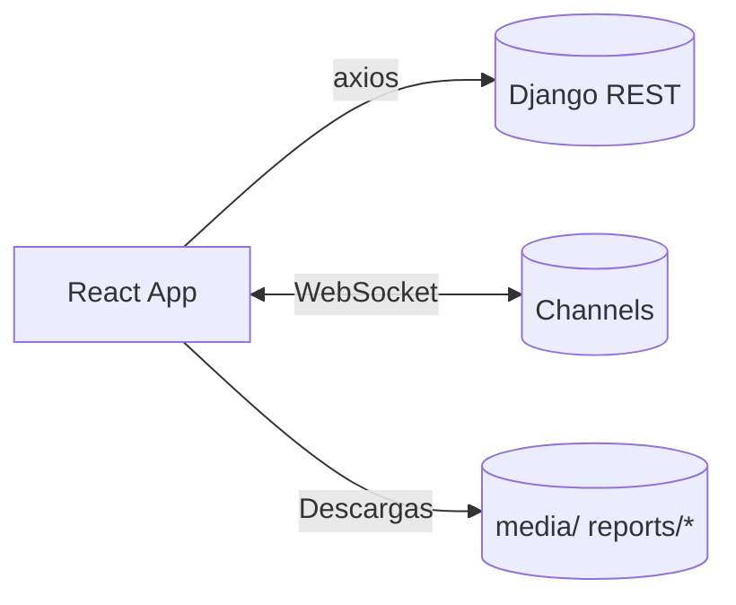

# Frontend del Sistema Biogestor (React + Vite + TS)

Guía completa para desarrollar, mantener y desplegar la interfaz web. Incluye arquitectura, estructura de carpetas, configuración, autenticación con JWT, websockets, páginas clave (Sensores y Reportes), patrones de código, rendimiento, pruebas, accesibilidad y solución de problemas.

Tabla de contenidos
- Visión general de la app
- Requisitos e instalación
- Variables de entorno y configuración
- Estructura del proyecto y convenciones
- Servicios de red (axios + interceptor JWT)
- Estado, estilos y componentes compartidos
- Páginas principales: Sensores y Reportes
- Cliente de API (`src/api/*`) y contratos
- Construcción, despliegue y rutas
- Testing y calidad del código
- Accesibilidad, i18n y UX
- Rendimiento y buenas prácticas
- Solución de problemas y FAQ

## 1) Visión general

La SPA del Biogestor consume APIs REST del backend y se integra en tiempo real mediante WebSockets para mostrar lecturas de sensores. También permite registrar nuevas etapas (llenados) y generar/descargar reportes (PDF/Excel/CSV).



## 2) Requisitos e instalación

- Node.js 18+
- Backend levantado en `http://localhost:8000`

Instalación (desde `frontend/react-app`):
```bash
npm install
npm run dev
```
Build de producción:
```bash
npm run build
npm run preview
```

## 3) Variables de entorno

Archivo `frontend/react-app/.env`:
```env
VITE_API_BASE_URL=http://localhost:8000
```
El interceptor lee esta variable para fijar `axios.defaults.baseURL`. Si no está definida, usa `http://localhost:8000`.

Refresh token: por defecto apunta a `http://localhost:8000/api/token/refresh/`. Si tu backend expone `/api/refrescar-token/`, actualiza la URL en `src/services/interceptor.ts`.

## 4) Estructura del proyecto

```
src/
  api/                 # Clientes HTTP tipados (dashboard.api.ts, etc.)
  features/
    sensors/           # Pantalla de Sensores (WebSockets y charts)
    reports/           # Pantalla de Reportes (solicitud y descargas)
    calculator/        # Calculadora (si aplica)
    dashboard/         # Otras vistas
  services/
    interceptor.ts     # Axios JWT + refresh
    authService.ts     # Utilidades de auth
  shared/              # Barra lateral/arriba, Card, etc.
  types/               # Tipos compartidos
  assets/              # Íconos/imagenes
```

Convenciones:
- Una carpeta por “feature” con su UI y lógica.
- Tipos y clientes API compartidos en `src/api/` y `src/types/`.
- Estilos con `styled-components` y componentes reutilizables en `src/shared/`.

## 5) Servicios de red (axios + interceptor)

`src/services/interceptor.ts`:
- Inyecta `Authorization: Bearer <token>` si `authToken` existe en `localStorage`.
- Ante `401`, intenta refrescar el access token con el refresh token (evita carreras con `refreshPromise`).
- Si el refresh falla, limpia storage y redirige a `/login`.

Patrones:
- Manejar errores detallados mostrando `response.data.detail` cuando esté disponible.
- Para descargas de archivos, usar `responseType: 'blob'`.

## 6) Estado, estilos y componentes

- Estado local con hooks (`useState`, `useEffect`).
- Estilos: `styled-components` para layout (contenedores, grids, cards) y tokens de color.
- Componentes de layout en `src/shared/*`: `BarraLateral`, `BarraArriba`, `Card`.

Accesibilidad:
- Evita usar texto solo con color para estados; añade íconos/labels.
- Usa semántica HTML (h1–h6, nav, main, section) cuando sea posible.

## 7) Páginas principales

### Sensores (`src/features/sensors/Sensors.tsx`)

Funciones clave:
- Conecta a `ws://localhost:8000/ws/mqtt/`.
- Interpreta mensajes de tipo `sensor_data` y crea/actualiza tarjetas dinámicamente.
- Gráfica métricas con `react-chartjs-2` y configuración de ejes (diario/acumulado).
- Modal “Nuevo llenado”: postea a `/api/dashboard/fillings/` con validaciones de formulario.
- Cargar producción actual: GET `/api/dashboard/production/current/`.

Estados y UX:
- Si el backend responde 404 al cargar producción, informar que no hay etapa activa.
- Reconexión WebSocket con backoff simple (5s).

### Reportes (`src/features/reports/Reports.tsx`)

Funciones clave:
- Solicitar reporte: POST `/api/dashboard/report/create/` con `report_type` (`normal|final`) y `observations`.
- Mostrar links de descarga (PDF/Excel/CSV) del último reporte.
- Historial: GET `/api/dashboard/report/history/` y render de tabla con botones de descarga por fila.
- La previsualización in-app fue eliminada para maximizar el espacio del formulario y tabla.

Filtros y búsqueda:
- Búsqueda por texto libre (operador/observaciones) – placeholder para futura implementación.
- Filtro por estado – actualmente métrica de ejemplo.

## 8) Cliente de API y contratos

`src/api/dashboard.api.ts` expone helpers tipados:
- `createFilling(data)` → `{ id }`
- `getCurrentProduction()` → `{ stage, expected, actual }`
- `createReport(reportType, observations)` → `{ id, pdf_url, excel_url, csv_url }`
- `getReportHistory()` → `history[]`
- `downloadReportFile(url)` → `Blob`

Contratos relevantes (resumen):
```ts
type Series = { days: number[]; daily_biogas_m3: number[]; cumulative_biogas_m3: number[] };
type CurrentProduction = { stage: {...}; expected: Series; actual: Series };
```

## 9) Construcción, despliegue y rutas

Build: `npm run build` genera artefactos en `dist/` (Vite). Para servir tras el backend, usa un servidor estático (Nginx) y apunta el frontend al backend via `VITE_API_BASE_URL`.

Rutas: React Router maneja la navegación interna. La barra lateral marca la vista actual (p. ej., “Sensores”, “Reportes”).

## 10) Testing y calidad

- Lint: `npm run lint` (ESLint + TS). Mantén el proyecto libre de warnings.
- Pruebas (sugerido): agregar Vitest/Jest + React Testing Library para componentes críticos (formularios, tabla de historial, manejo de errores HTTP).
- Casos manuales útiles:
  - Llenado: validar capturas de errores de formulario.
  - Reporte: solicitar y descargar archivos, probar errores 400/500.
  - WS: simular mensajes y comprobar creación de tarjetas dinámicas.

## 11) Accesibilidad, i18n y UX

- Usa labels claras y ayudas de texto en formularios.
- Mantén suficiente contraste en tarjetas/estadísticas.
- Preparar futuro i18n externalizando textos a un módulo central.

## 12) Rendimiento y buenas prácticas

- Evitar renders innecesarios separando componentes en memorized units cuando crezcan.
- Liberar `ObjectURL` después de descargas para evitar fugas de memoria.
- Cargar condicionalmente librerías pesadas si aplica (charts adicionales, etc.).

## 13) Solución de problemas y FAQ

- No carga producción y muestra 404 → no hay etapa activa en backend.
- Descargas abren texto ilegible → asegúrate de usar `responseType: 'blob'` y cabeceras correctas en backend.
- 401 en todas las requests → tokens vencidos; confirma `refreshToken` y endpoint de refresh.
- WebSocket desconectado → verifica ASGI en backend y que `ws://localhost:8000/ws/mqtt/` sea accesible (CORS no afecta WS, pero proxies sí).

## 14) Roadmap de mejoras (frontend)

- Botón “Regenerar” en historial para `/api/dashboard/report/regenerate/<id>/`.
- Gráficas enriquecidas (tooltips avanzados, agregados semanales, export de PNG).
- Búsqueda/filtrado real en historial con paginación.
- Tests E2E con Playwright (descargas y flujo de reportes).
